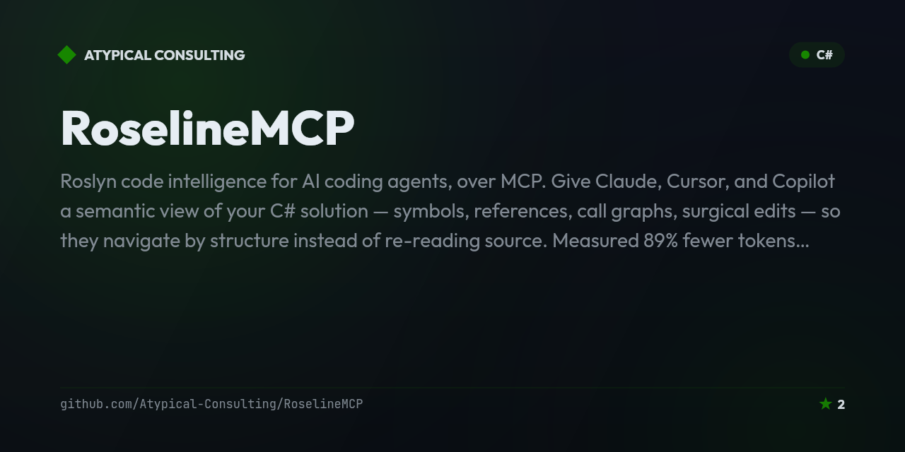

# RoselineMCP

<!-- mcp-name: io.github.Atypical-Consulting/roseline-mcp -->

> **Roslyn code intelligence for AI coding agents, over MCP.** Give Claude, Cursor, and Copilot a semantic view of your C# solution — symbols, references, call graphs, surgical edits — so they navigate by *structure* instead of re-reading source. **[Measured 89% fewer tokens (median) →](https://atypical-consulting.github.io/RoselineMCP/benchmark)**

<!-- Badges: Row 1 — Identity -->
[](https://github.com/Atypical-Consulting/RoselineMCP)
[](https://opensource.org/licenses/MIT)
[](https://dotnet.microsoft.com/)
[](https://github.com/Atypical-Consulting/RoselineMCP)
[](https://github.com/Atypical-Consulting/RoselineMCP)

<!-- Badges: Row 2 — Activity -->
[](https://github.com/Atypical-Consulting/RoselineMCP/releases/)
[](https://github.com/Atypical-Consulting/RoselineMCP/issues)
[](https://github.com/Atypical-Consulting/RoselineMCP/pulls)
[](https://github.com/Atypical-Consulting/RoselineMCP/commits/main)

<!-- Badges: Row 3 — Quality -->
[](https://github.com/Atypical-Consulting/RoselineMCP/actions/workflows/ci.yml)

<!-- Badges: Row 4 — Distribution -->
[](https://www.nuget.org/packages/RoselineMCP/)
[](https://hub.docker.com/r/phmatray/roseline-mcp)

<!-- Badges: Row 5 — Docs & result -->
[](https://atypical-consulting.github.io/RoselineMCP/)
[-1baf7a)](https://atypical-consulting.github.io/RoselineMCP/benchmark)

**📖 [Documentation, tool reference & the honest benchmark →](https://atypical-consulting.github.io/RoselineMCP/)**

---

## Table of Contents

- [Why RoselineMCP](#why-roselinemcp)
- [Quick Start](#quick-start)
- [Features](#features)
- [Tech Stack](#tech-stack)
- [Getting Started](#getting-started)
- [MCP Client Compatibility](#mcp-client-compatibility)
- [Available Tools](#available-tools)
- [Tool Annotations](#tool-annotations)
- [Tool Compatibility Policy](#tool-compatibility-policy)
- [Architecture](#architecture)
- [Project Structure](#project-structure)
- [Security](#security)
- [Documentation](#documentation)
- [Roadmap](#roadmap)
- [Contributing](#contributing)
- [License](#license)
- [Acknowledgments](#acknowledgments)

## Why RoselineMCP

Your coding agent shouldn't read a 700-line file to change one method. Source code dominates an
agent's token budget, so the cheapest win is to stop feeding it whole files.

RoselineMCP wraps the [Roslyn](https://github.com/dotnet/roslyn) compiler platform as an MCP server.
Instead of dumping source into the model, it answers *structural* questions precisely — where is
this symbol used, what implements this interface, who calls this method, what's the shape of this
file — and it edits **surgically**: a member-level diff, not a whole-file rewrite.

On RoselineMCP's own source, the read-only navigation tools returned a **median 89% fewer tokens
per task** (pooled, size-weighted: 93%) than reading the corresponding files —
[measured honestly, weak cases included](https://atypical-consulting.github.io/RoselineMCP/benchmark).

> `search_symbols` on `Program.cs`: **1,638 tokens → 71** (−96%). The agent gets the shape of the
> file; you skip the wall.

## Quick Start

Any MCP client that speaks `dnx` (the .NET equivalent of `npx`) runs it on demand — no install step.
Requires the .NET 10 SDK.

```jsonc
// claude_desktop_config.json  ·  .vscode/mcp.json  ·  ~/.cursor/mcp.json
{
  "mcpServers": {
    "roseline": { "command": "dnx", "args": ["RoselineMCP", "--yes"] }
  }
}
```

Then ask your agent to *"find every caller of `OrderService.Checkout`"* or *"rename `Foo` to `Bar`
across the solution."* Prefer a pinned NuGet install or Docker? See
[Getting Started](#getting-started).

## Features

- [x] **Token-efficient code navigation** -- symbols, references, call graphs, type hierarchies, and file outlines via Roslyn instead of whole files. A measured **89% median** token reduction per task (93% pooled, size-weighted) -- [see the benchmark](https://atypical-consulting.github.io/RoselineMCP/benchmark).
- [x] **Surgical code edits** -- replace/add/delete a member or rename a symbol solution-wide, emitting a unified diff instead of a whole-file rewrite. Preview by default.
- [x] **Comprehensive analysis & auto-fix** -- diagnostics across a solution (Roslyn + Roslynator) with automated fixes and reviewable patches.
- [x] **Read-only by default** -- the seven navigation tools and the diagnostics/patch tools never touch disk; the three write tools require an explicit `previewOnly: false`.
- [x] **Works with your client** -- Claude Desktop, VS Code (Copilot / MCP), Cursor. Install via `dnx`, NuGet global tool, or Docker.
- [x] **Honest, reproducible benchmark** -- run it against your own solution: `dotnet run --project RoselineMCP.TokenBenchmark -c Release`.

## Tech Stack

| Layer | Technology |
|-------|-----------|
| Runtime | .NET 10.0 |
| Compiler Platform | Roslyn (Microsoft.CodeAnalysis) 5.6.0 |
| Analyzers | Roslynator 4.15.0 |
| MCP SDK | ModelContextProtocol 1.4.1 |
| Diff Engine | DiffPlex 1.9.0 |
| Build System | MSBuild 18.8.2 |
| Hosting | Microsoft.Extensions.Hosting 10.0.10 |

> Versions above are kept in sync with [`RoselineMCP/RoselineMCP.csproj`](RoselineMCP/RoselineMCP.csproj) — that file is the source of truth if this table ever drifts.

## Getting Started

### Prerequisites

- **NuGet global tool**: .NET 10.0 SDK or later
- **Docker**: Docker Desktop or Docker Engine
- **Build from source**: .NET 10.0 SDK + MSBuild (included with Visual Studio or .NET SDK)
- **MCP client**: Claude Desktop or any MCP-compatible client

### Installation

> **Claude Desktop, one click:** download **`RoselineMCP.mcpb`** from the
> [latest release](https://github.com/Atypical-Consulting/RoselineMCP/releases/latest) and open it —
> Claude Desktop shows an install dialog, no config editing. (It launches via `dnx` under the hood,
> so the .NET 10 SDK is still required.) Prefer to edit config yourself, or using another client?
> Use one of the options below.

**Option 1 -- `dnx` (no install step)** *(recommended)*

RoselineMCP ships an [MCP server registry manifest](.mcp/server.json), so any MCP client that
understands the `dnx` launcher (the .NET equivalent of `npx` — resolves and runs a NuGet-packaged
tool on demand, without a separate `dotnet tool install` step) can start it directly. Requires the
.NET 10.0 SDK.

```json
{
  "mcpServers": {
    "roseline": {
      "command": "dnx",
      "args": ["RoselineMCP", "--yes"]
    }
  }
}
```

Add this to your Claude Desktop or VS Code MCP configuration (see
[MCP Client Compatibility](#mcp-client-compatibility) below for exact file locations per client).
`dnx` downloads and caches the tool on first use, so there's nothing to pre-install globally.

---

**Option 2 -- NuGet Global Tool** *(offline / pinned-version installs)*

Requires .NET 10.0 SDK or later.

```bash
dotnet tool install -g RoselineMCP
```

After installation, the `roseline-mcp` command is available globally.

#### Claude Desktop configuration (NuGet global tool)

Add to your Claude Desktop configuration file (`claude_desktop_config.json`):

```json
{
  "mcpServers": {
    "roseline": {
      "command": "roseline-mcp"
    }
  }
}
```

> **Config file location:**
> - macOS: `~/Library/Application Support/Claude/claude_desktop_config.json`
> - Windows: `%APPDATA%\Claude\claude_desktop_config.json`

---

**Option 3 -- Docker**

No SDK required. Works on any platform with Docker installed.

```bash
docker run -i --rm phmatray/roseline-mcp:latest
```

#### Claude Desktop configuration (Docker)

```json
{
  "mcpServers": {
    "roseline": {
      "command": "docker",
      "args": [
        "run",
        "-i",
        "--rm",
        "phmatray/roseline-mcp:latest"
      ]
    }
  }
}
```

> **Note:** The `-i` flag is required for stdio transport. The `--rm` flag removes the container after the session ends.

---

**Option 4 -- Build from Source**

```bash
git clone https://github.com/Atypical-Consulting/RoselineMCP.git
cd RoselineMCP
dotnet build
dotnet test
```

#### Claude Desktop configuration (build from source)

```json
{
  "mcpServers": {
    "roseline": {
      "command": "dotnet",
      "args": ["run", "--project", "/path/to/RoselineMCP/RoselineMCP.csproj"]
    }
  }
}
```

## MCP Client Compatibility

RoselineMCP speaks plain stdio MCP, so it should work with any MCP-compatible client. The
snippets below are **documented, not independently verified in every case** — we've confirmed the
protocol-level behavior (stdio transport, tool discovery, JSON responses) works correctly, but we
have not personally exercised each client's own configuration UI/file end to end. If one of these
doesn't work as written for your client version, please open an issue.

<details>
<summary><strong>Claude Desktop</strong></summary>

Edit `claude_desktop_config.json` (see file locations under [Installation](#getting-started)
above) and add a `roseline` entry under `mcpServers`, using any of the four install options shown
above (`dnx`, global tool, Docker, or build-from-source).

</details>

<details>
<summary><strong>VS Code (GitHub Copilot / MCP extension)</strong></summary>

Add an entry to your workspace or user `mcp.json` (Command Palette → "MCP: Open User
Configuration", or `.vscode/mcp.json` in the workspace):

```json
{
  "servers": {
    "roseline": {
      "command": "dnx",
      "args": ["RoselineMCP", "--yes"]
    }
  }
}
```

Substitute `"command": "roseline-mcp"` (no `args`) if you installed via the NuGet global tool
instead.

</details>

<details>
<summary><strong>Cursor</strong></summary>

Add a `roseline` entry to `~/.cursor/mcp.json` (global) or `.cursor/mcp.json` (project-local),
using the same `command`/`args` shape as the VS Code snippet above.

</details>

## Available Tools

### 1. AnalyzeSolution

Analyzes an entire C# solution for diagnostics. Read-only — never modifies files on disk.
`pathOrGit` also accepts an `http(s)://` Git URL, which is shallow-cloned to a temp directory,
analyzed, and deleted afterward.

```typescript
analyzeSolution({
  pathOrGit: "/path/to/solution.sln",
  include: "Core",              // Optional: only project names containing this substring
  exclude: "Test",              // Optional: skip project names containing this substring
  severity: "warning",          // Optional: minimum severity (Error|Warning|Info|Hidden)
  maxDiagnostics: 100           // Optional: Maximum diagnostics to return (default: 100)
})
```

**Returns:** solution file name, project count, a `diagnosticSummary` (counts by severity), and a
`topDiagnostics` array with project/file/line/column/id/severity/message per diagnostic.

### 2. ListDiagnostics

Gets detailed diagnostics for a specific project. Read-only — never modifies files on disk.
`project` is **optional** and accepts the same references as the navigation tools (name,
directory, `.csproj`, or `.sln` path); when omitted, the solution/project is auto-discovered from
the working directory.

```typescript
listDiagnostics({
  project: "MyProject.csproj",     // Optional: name, directory, .csproj, or .sln; auto-discovered if omitted
  ids: ["CS0168", "CS0219"],       // Optional: Filter by diagnostic IDs
  files: ["Controller.cs"],        // Optional: substring match against each diagnostic's file path (case-insensitive; NOT a glob pattern)
  max: 50                          // Optional: Maximum results
})
```

**Returns:** project name, `totalDiagnostics` count, the filtered `diagnostics` list, `stats`
(counts grouped by ID and by severity), and `suggestedFixableIds` — diagnostic IDs a code fix
provider is actually registered for.

### 3. ApplyFixes

Applies automated code fixes for specified diagnostics. **Defaults to preview mode**:
`previewOnly` defaults to `true`, so calling this tool without setting it never writes to disk —
you must pass `previewOnly: false` explicitly to apply changes. `project` is **optional** and
accepts the same references as the navigation tools (name, directory, `.csproj`, or `.sln` path);
when omitted, the solution/project is auto-discovered from the working directory.

```typescript
applyFixes({
  ids: ["CS0168", "RCS1001"],   // Diagnostic IDs to fix
  project: "MyProject.csproj",  // Optional: name, directory, .csproj, or .sln; auto-discovered if omitted
  previewOnly: false             // Optional (default: true). Set false to write changes to disk.
})
```

**Returns:** project name, `fixedCount`, `fixersApplied` (diagnostic IDs actually fixed),
`changedFiles` (solution-root-relative, forward slashes — the same path base as the navigation
tools), a unified diff `patch`, `notes` (skipped/failed IDs and status messages), and
`previewOnly` echoing back whether anything was written.

### 4. CreatePatch

Generates a unified diff between two text versions. Read-only — operates purely on the provided
strings, never touches the filesystem.

```typescript
createPatch({
  before: "original code",
  after: "modified code",
  fileName: "Example.cs",        // Optional: For display in diff
  ignoreWhitespace: false,       // Optional: ignore whitespace-only differences
  ignoreCase: false              // Optional: ignore case differences
})
```

**Returns:** the unified diff `patch`, `hasChanges`, `linesAdded`, `linesRemoved`, and the
`fileName`/`summary` used in the diff header.

### Code Navigation Tools (read-only)

These tools return **precise structure instead of whole files**, so an AI agent can orient itself
in a codebase while spending far fewer tokens than reading source directly. All are read-only and
take an **optional** `project` (name, directory, `.csproj` path, or `.sln` path) — when omitted,
RoselineMCP auto-discovers the solution/project from its working directory. When the project belongs
to a solution, the whole solution is loaded and symbol search/resolution spans every project in it
(including sibling projects the requested project doesn't reference), so references/renames span
projects. Full request/response shapes are in [docs/API.md](docs/API.md).

> **Tool names on the wire are `snake_case`.** The section headings below use friendly
> PascalCase/`camelCase` for readability, but the actual MCP tool names returned by `tools/list`
> (and expected by `tools/call`) are: `search_symbols`, `get_symbol_info`, `find_references`,
> `find_implementations`, `get_call_graph`, `get_type_hierarchy`, `get_symbol_at_position`,
> `edit_member`, `rename_symbol`
> (matching the existing `analyze_solution` / `list_diagnostics` / `apply_fixes` / `create_patch`).

#### 5. SearchSymbols

Find symbols by wildcard/substring name pattern, or outline a single file.

```typescript
searchSymbols({
  project: "MyApp.Core",
  query: "*Service",             // Substring, or wildcard with * and ? — omit to outline a file
  file: "UserService.cs",        // Optional: restrict to one file, or outline it when query omitted
  kinds: ["class", "method"],    // Optional: filter by kind (also accepts "type" / "member")
  max: 50                        // Optional (default: 50)
})
```

**Returns:** `symbols` (name, fullName, kind, signature, file, line — file paths are solution-root-relative; the single-file outline instead returns name, kind, signature, line, containingType), `totalFound`, `truncated` (omitted when not capped).

#### 6. GetSymbolInfo

The compact "go to definition": a symbol's declaration metadata and (optionally) its source.

```typescript
getSymbolInfo({
  project: "MyApp.Core",
  symbol: "Acme.Users.UserService.GetUser",  // Simple or fully-qualified name
  includeSource: true                          // Optional (default: true)
})
```

**Returns:** name, fullName, kind, signature, and (each omitted when empty/absent) modifiers, baseTypes, interfaces, documentation, definitionFile/Line, and source. Accessibility is already part of `signature`; `definitionFile` is solution-root-relative.

#### 7. FindReferences

Every use site of a symbol across the solution, as location + one-line snippet.

```typescript
findReferences({ project: "MyApp.Core", symbol: "GetUser", includeDefinition: false, max: 100 })
```

**Returns:** `references` (file — solution-root-relative, line, snippet), `totalReferences`, `truncated` (omitted when not capped).

#### 8. FindImplementations

Implementations of an interface/member, overrides of a virtual/abstract member, or derived types of a class.

```typescript
findImplementations({ project: "MyApp.Core", symbol: "IRepository", max: 100 })
```

**Returns:** `implementations` (symbol summaries), `totalFound`, `truncated`.

#### 9. GetCallGraph

A depth-bounded caller and/or callee graph for a method, with cycle detection.

```typescript
getCallGraph({
  project: "MyApp.Core",
  method: "Handle",
  direction: "callers",   // "callers" (default) | "callees" | "both"
  depth: 1,               // 1-3 (default: 1)
  max: 50                 // Optional: nodes expanded per direction
})
```

**Returns:** `callers`/`callees` trees of nodes (fullName with simple parameter-type names, file — solution-root-relative, line, truncated, children). Call GetSymbolInfo for a node's full signature.

#### 10. GetTypeHierarchy

A type's base-class chain, implemented interfaces, and/or derived types.

```typescript
getTypeHierarchy({
  project: "MyApp.Core",
  type: "SqlRepository",
  direction: "both",   // "base" | "derived" | "both" (default)
  max: 100             // Optional: maximum derived types returned (default: 100)
})
```

**Returns:** `baseTypes`, `interfaces`, `derivedTypes` (as symbol summaries).

#### 13. GetSymbolAtPosition

The symbol living at a `file:line(:column)` position — turn a diagnostic, stack trace, or grep hit
into a symbol name without reading the file.

```typescript
getSymbolAtPosition({
  project: "MyApp.Core",
  file: "UserService.cs",  // File name or path suffix (same matching as SearchSymbols)
  line: 42,                // 1-based
  column: 17               // Optional (1-based) — omit to resolve the most relevant symbol on the line
})
```

**Returns:** name, fullName, kind, signature, `isDeclaration` (whether the position sits on the symbol's own declaration), and (each omitted when empty/absent) containingType, documentation, definitionFile/Line (solution-root-relative). Line-only queries prefer declarations on the line over referenced symbols.

### Code Editing Tools (preview by default)

Surgical edits that emit a member-level change rather than a whole-file rewrite. Like `ApplyFixes`,
both **default to preview mode** (`previewOnly: true`) — nothing is written to disk unless you pass
`previewOnly: false` explicitly.

#### 11. EditMember

Replace, add, or delete a single type member; returns a unified diff.

```typescript
editMember({
  project: "MyApp.Core",
  symbol: "Acme.UserService.GetUser",  // The member (replace/delete), or the container type (add)
  operation: "replace",                 // "replace" | "add" | "delete"
  newSource: "public User GetUser(int id) => _repo.Find(id);",  // Required for replace/add
  previewOnly: false                    // Optional (default: true). Set false to write to disk.
})
```

**Returns:** operation, target, `changedFiles`, `patch`, `previewOnly`, `applied`, `notes`.

#### 12. RenameSymbol

Rename a symbol and update every reference across the solution (Roslyn rename); returns a unified diff.

```typescript
renameSymbol({ project: "MyApp.Core", symbol: "GetUser", newName: "GetUserById", previewOnly: false })
```

**Returns:** symbol, newName, `changedFiles`, `patch`, `previewOnly`, `applied`, `notes`.

## Tool Annotations

RoselineMCP's SDK (`ModelContextProtocol` 1.4.1) supports the standard MCP tool
[annotation hints](https://modelcontextprotocol.io/) (`readOnlyHint`, `destructiveHint`,
`idempotentHint`), and every tool declares them via `[McpServerTool(ReadOnly = ..., Destructive =
..., Idempotent = ...)]`:

| Tool | readOnlyHint | destructiveHint | idempotentHint | Notes |
|------|:---:|:---:|:---:|-------|
| `AnalyzeSolution` | ✅ true | ❌ false | ✅ true | Never writes to disk. |
| `ListDiagnostics` | ✅ true | ❌ false | ✅ true | Never writes to disk. |
| `ApplyFixes` | ❌ false | ⚠️ true | ❌ false | `destructiveHint` is a static, worst-case annotation: it's `true` because the tool *can* write files when `previewOnly: false` is passed, even though the default call (`previewOnly` unset, i.e. `true`) writes nothing. The SDK's annotation model has no way to express "destructive only for a specific parameter value" — see the doc comment on `ApplyFixesTool.ApplyFixes` in source. |
| `CreatePatch` | ✅ true | ❌ false | ✅ true | Operates purely on the two provided strings; never touches the filesystem. |
| `SearchSymbols` | ✅ true | ❌ false | ✅ true | Never writes to disk. |
| `GetSymbolInfo` | ✅ true | ❌ false | ✅ true | Never writes to disk. |
| `FindReferences` | ✅ true | ❌ false | ✅ true | Never writes to disk. |
| `FindImplementations` | ✅ true | ❌ false | ✅ true | Never writes to disk. |
| `GetCallGraph` | ✅ true | ❌ false | ✅ true | Never writes to disk. |
| `GetTypeHierarchy` | ✅ true | ❌ false | ✅ true | Never writes to disk. |
| `GetSymbolAtPosition` | ✅ true | ❌ false | ✅ true | Never writes to disk. |
| `EditMember` | ❌ false | ⚠️ true | ❌ false | Same worst-case `destructiveHint` rationale as `ApplyFixes`: writes a file only when `previewOnly: false` is passed; the default call writes nothing. |
| `RenameSymbol` | ❌ false | ⚠️ true | ❌ false | Same worst-case `destructiveHint` rationale as `ApplyFixes`: writes files only when `previewOnly: false` is passed; the default call writes nothing. |

These hints are static per-tool metadata for MCP clients that surface them (e.g. to warn a user
before an agent invokes a destructive tool) — they describe the tool's worst-case behavior, not
the outcome of any specific call. See [Tool Compatibility Policy](#tool-compatibility-policy)
below for the stability guarantees around tool names and parameters that these annotations sit on
top of.

## Tool Compatibility Policy

- **Tool names and required parameters are stable within a major version.** An MCP client
  integration written against `AnalyzeSolution(pathOrGit, ...)` on `1.x` will keep working across
  all `1.x` releases.
- **Optional parameters may be added in minor versions** (e.g. `CreatePatch` gained
  `ignoreWhitespace`/`ignoreCase` as optional, defaulted parameters without breaking existing
  callers).
- **Renaming or removing a parameter, changing a parameter's required/optional status, or
  changing a tool's name is a breaking change.** Breaking changes are called out under a
  dedicated "Breaking Changes" heading in [`CHANGELOG.md`](CHANGELOG.md) and only ship in a major
  version bump.
- Response *shapes* (JSON field names/types) are documented in [`docs/API.md`](docs/API.md) and
  follow the same policy: additive fields are non-breaking, renamed/removed fields are breaking.

## Supported Analyzers

The diagnostics tools (`analyze_solution`, `list_diagnostics`, `apply_fixes`) report compiler
diagnostics plus analyzer diagnostics, executed via Roslyn's `CompilationWithAnalyzers`:

- **Roslyn Analyzers** -- Built-in C# compiler diagnostics
- **Roslynator** -- 500+ analyzers and fixes for C#, **bundled with RoselineMCP** (shipped as an
  `analyzers/` folder next to `RoselineMCP.dll`) and executed by default, so RCS* diagnostics
  surface and are fixable out of the box
- **Custom Analyzers** -- Any Roslyn-based analyzer referenced by your analyzed solution is
  loaded from the project's analyzer references and run alongside the bundled ones (there is no
  built-in StyleCop.Analyzers reference — add it to your analyzed solution if you want SA*
  diagnostics; analyzer-reported rules are auto-fixable only when a matching fixer is loadable)

Set `RoselineMCP:RunAnalyzers` to `false` for compiler-only diagnostics (faster on big
solutions; see [Configuration](#configuration) and the analyzer-execution note in
[`SECURITY.md`](SECURITY.md)).

## Examples

### Analyzing a Solution

```bash
# Using with an MCP client
mcp call analyzeSolution '{
  "pathOrGit": "/Users/dev/MyProject/MyProject.sln",
  "severity": "warning",
  "maxDiagnostics": 50
}'
```

Response:
```json
{
  "solution": "MyProject.sln",
  "projects": 5,
  "diagnosticSummary": {
    "error": 2,
    "warning": 15,
    "info": 28
  },
  "topDiagnostics": [
    {
      "id": "CS0168",
      "severity": "warning",
      "message": "The variable 'ex' is declared but never used",
      "file": "Program.cs",
      "line": 42
    }
  ]
}
```

### Applying Fixes

```bash
mcp call applyFixes '{
  "project": "MyProject.Core.csproj",
  "ids": ["CS0168", "RCS1001"],
  "previewOnly": true
}'
```

Response includes a unified diff patch showing all changes that would be applied.

## Configuration

RoselineMCP reads `appsettings.json` and `appsettings.{Environment}.json` from the directory the
server binary is installed in (`AppContext.BaseDirectory`) — **not** from the process working
directory. Launching the server from inside a target repository never picks up that repository's
own `appsettings.json`, and the settings packaged with the `dotnet tool` install are always found.
Configuration is read once at startup; there is no reload-on-change file watching.

### Environment Variables

Environment variables prefixed with `ROSELINE_` override the JSON files, using `__` as the section
separator. Settings under the `RoselineMCP` section therefore take a double prefix:

```bash
# RoselineMCP:EnableDiagnosticLogging
ROSELINE_RoselineMCP__EnableDiagnosticLogging=true

# RoselineMCP:DefaultTimeout (ms)
ROSELINE_RoselineMCP__DefaultTimeout=300000

# RoselineMCP:RunAnalyzers (compiler-only diagnostics when false)
ROSELINE_RoselineMCP__RunAnalyzers=false

# Logging:LogLevel:RoselineMCP
ROSELINE_Logging__LogLevel__RoselineMCP=Debug
```

- `DOTNET_ENVIRONMENT`: Set environment (Development, Production)

### appsettings.json

Configure logging and other settings:

```json
{
  "Logging": {
    "LogLevel": {
      "Default": "Information",
      "RoselineMCP": "Debug"
    }
  },
  "RoselineMCP": {
    "DefaultTimeout": 120000,
    "EnableDiagnosticLogging": false,
    "WorkspaceCache": true,
    "RunAnalyzers": true
  }
}
```

- `RoselineMCP:DefaultTimeout`: Wall-clock timeout (ms) applied to each tool call, in addition to the caller's own cancellation. `0` disables it.
- `RoselineMCP:EnableDiagnosticLogging`: Opt-in, local-only tracing of tool invocations — see [Debug Logging](#debug-logging). Disabled by default; enabled in `appsettings.Development.json`.
- `RoselineMCP:WorkspaceCache`: Reuse the loaded MSBuild workspace across navigation/edit tool calls (enabled by default) — see [Performance](#performance). Set to `false` to load a fresh workspace on every call. **This is an isolation/debugging switch, not a memory-saving one** — measured, disabling it costs ~26% more resident memory and ~45× second-call latency; see [Memory Management](docs/ARCHITECTURE.md#memory-management).
- `RoselineMCP:RunAnalyzers`: Run Roslyn analyzers (bundled Roslynator + the target project's own analyzer references) in the diagnostics tools (enabled by default) — see [Supported Analyzers](#supported-analyzers). Set to `false` for compiler-only diagnostics.

## Architecture

RoselineMCP uses **stdio transport** — this is an intentional design decision. The server runs as a local process launched by the MCP client (Claude Desktop, AI agents), communicates over stdin/stdout, and exits when the client disconnects. This makes it perfectly suited for distribution as a NuGet global tool (`dotnet tool install -g RoselineMCP`) or Docker image — no port binding, no HTTP server, no infrastructure to manage.

```
┌─────────────────────┐
│   MCP Client        │
│  (Claude Desktop,   │
│   AI Assistants)    │
└────────┬────────────┘
         │ MCP Protocol (stdio)
         ▼
┌─────────────────────┐
│   RoselineMCP       │
│   MCP Server        │
│                     │
│  ┌───────────────┐  │
│  │  Tool Layer   │  │
│  │  (Analyze,    │  │
│  │   Fix, Patch) │  │
│  └───────┬───────┘  │
│          ▼          │
│  ┌───────────────┐  │
│  │ Service Layer │  │
│  │ (Workspace,   │  │
│  │  Diagnostics) │  │
│  └───────┬───────┘  │
│          ▼          │
│  ┌───────────────┐  │
│  │ Roslyn +      │  │
│  │ Roslynator    │  │
│  │ Analyzers     │  │
│  └───────────────┘  │
└─────────────────────┘
         │
         ▼
┌─────────────────────┐
│  C# Source Code     │
│  (.sln / .csproj)   │
└─────────────────────┘
```

## Project Structure

```
RoselineMCP/
├── RoselineMCP/
│   ├── Interfaces/       # Service interfaces
│   ├── Services/         # Core business logic
│   ├── Tools/            # MCP tool implementations
│   ├── Models/           # Data transfer objects
│   └── Program.cs        # Application entry point
├── RoselineMCP.Tests/    # Unit tests
├── .github/workflows/    # CI/CD pipelines
├── Dockerfile            # Container build
└── RoselineMCP.sln       # Solution file
```

## Performance

- **Workspace Cache** -- The navigation, edit, and diagnostics/fix tools (`ListDiagnostics`,
  `ApplyFixes`, and everything backed by `IProjectLoader`) reuse the loaded `MSBuildWorkspace`
  across calls, cutting hundreds of milliseconds of reload off every call after the first. Cached
  entries are fingerprinted (last-write-time + size of the `.sln`, every `.csproj`, and every
  source file, plus their directories) and re-checked on each call, so any change on disk —
  including RoselineMCP's own edits — triggers a fresh reload. Disable with
  `RoselineMCP:WorkspaceCache = false` — but note that this is an isolation/debugging switch, **not**
  a way to reduce memory: a disposed workspace's memory is not returned to the OS, so disabling the
  cache measures ~26% *worse* on resident memory as well as ~45× slower. The measured profile — and
  why an idle-release was evaluated and rejected — is in
  [Memory Management](docs/ARCHITECTURE.md#memory-management)
- **Workspace Isolation (AnalyzeSolution)** -- `AnalyzeSolution` still creates a fresh
  `MSBuildWorkspace` per operation (see [Architecture](#architecture))
- **Sequential Project Analysis** -- Projects within a solution are analyzed one at a time, not
  concurrently, to keep MSBuild workspace state consistent
- **Result Capping** -- `maxDiagnostics`/`max` bound how many diagnostics are returned per call,
  independent of how many were found

## Security

- **Read-Only by Default** -- `AnalyzeSolution`, `ListDiagnostics`, `CreatePatch`, and all six code
  navigation tools (`SearchSymbols`, `GetSymbolInfo`, `FindReferences`, `FindImplementations`,
  `GetCallGraph`, `GetTypeHierarchy`) never write to disk. The three write-capable tools —
  `ApplyFixes`, `EditMember`, and `RenameSymbol` — each default to `previewOnly: true`; writing
  requires the caller to pass `previewOnly: false` explicitly.
- **Real, Read-Only Git Cloning** -- `pathOrGit` accepts `http(s)://` Git URLs, which are
  shallow-cloned (`git clone --depth 1`) into a temp directory that's deleted after the operation.
  No other URL scheme is treated as a Git remote.
- **MSBuild Is Not a Sandbox** -- loading a `.sln`/`.csproj` via `MSBuildWorkspace` is a
  design-time MSBuild evaluation and can execute build logic embedded in the project (`<Exec>`
  tasks, custom `UsingTask` assemblies, imported `.targets`/`.props`). Analyzing a fully untrusted
  repository or URL carries a real code-execution risk on the host. **See
  [`SECURITY.md`](SECURITY.md)** for the full write-up and operator recommendations before
  pointing RoselineMCP at untrusted input.
- **Analyzer Execution Is Code Execution** -- the diagnostics tools also run the target project's
  own referenced Roslyn analyzers in-process (see
  [Supported Analyzers](#supported-analyzers)); an analyzer from an untrusted repository is
  arbitrary code. `RoselineMCP:RunAnalyzers = false` disables all analyzer execution (bundled
  Roslynator included). See [`SECURITY.md`](SECURITY.md).
- **No Dedicated Path-Traversal Sandbox** -- paths are resolved with plain existence checks, not
  canonicalized against an allowed root; treat `pathOrGit`/`project`/`branch` as trusted operator
  input.

## Troubleshooting

### Common Issues

1. **MSBuild not found**: Ensure .NET SDK is installed and in PATH
2. **Solution won't load**: Check for missing NuGet packages, run `dotnet restore`
3. **No analyzer (RCS*/SA*) diagnostics found**: Verify `RoselineMCP:RunAnalyzers` isn't set to `false`; for non-bundled rule sets (e.g. StyleCop), verify the analyzer is installed in the target project
4. **Permission denied**: Ensure read access to solution files

### Debug Logging

Enable detailed logging:

```bash
ROSELINE_Logging__LogLevel__RoselineMCP=Debug dotnet run --project RoselineMCP/RoselineMCP.csproj
```

### Tracing Individual Tool Calls

Every tool call gets a per-invocation correlation ID (a GUID). It's cheap to generate so it's
always created, but it's only surfaced when you need it: it's included in every JSON error
response (`correlationId`) and attached to that call's log lines via `ILogger.BeginScope`, so a
user reporting a failure can hand you one ID that ties back to the full server-side log entry —
without needing to grep timestamps.

For deeper, opt-in tracing of each tool invocation (start/stop, duration, success/failure) as a
`System.Diagnostics.Activity` span, set `RoselineMCP:EnableDiagnosticLogging` to `true` (it's
already `true` in `appsettings.Development.json`):

```bash
ROSELINE_RoselineMCP__EnableDiagnosticLogging=true dotnet run --project RoselineMCP/RoselineMCP.csproj
```

This uses the built-in `ActivitySource`/`Activity` APIs rather than the OpenTelemetry SDK, so it
adds no extra dependency. Spans are logged exclusively through the existing `ILogger` pipeline,
which is already routed to stderr — never to stdout (the MCP JSON-RPC channel) — and nothing is
ever sent over the network; when the flag is off (the default), no listener is registered and the
spans cost essentially nothing.

## Roadmap

- [ ] Additional analyzer rule sets (SonarAnalyzer, FxCop)
- [ ] Auto-fix suggestions with confidence scoring
- [ ] CI/CD integration for automated analysis pipelines
- [ ] Multi-solution support in a single session
- [ ] Incremental analysis (only changed files)
- [ ] Custom analyzer rule configuration via MCP

> Want to contribute? Pick any roadmap item and open a PR!

## Documentation

- **[Documentation site](https://atypical-consulting.github.io/RoselineMCP/)** -- overview, tool
  reference, and the [token-savings benchmark](https://atypical-consulting.github.io/RoselineMCP/benchmark)
  (built from `website/`, deployed to GitHub Pages)
- [docs/API.md](docs/API.md) -- Full request/response reference for every MCP tool, service
  interfaces, models, and the error-response contract
- [docs/AGENT-BENCHMARK.md](docs/AGENT-BENCHMARK.md) -- End-to-end A/B: does an AI agent actually
  spend fewer tokens with RoselineMCP? (honest answer — a large-codebase win, break-even on small)
- [docs/ARCHITECTURE.md](docs/ARCHITECTURE.md) -- Layered architecture, data flow, and design
  patterns
- [PROMPTS.md](PROMPTS.md) -- Example prompts and end-to-end workflows for each tool
- [CHANGELOG.md](CHANGELOG.md) -- Release history and breaking changes
- [SECURITY.md](SECURITY.md) -- Vulnerability reporting and the MSBuild code-execution caveat
- [CONTRIBUTING.md](CONTRIBUTING.md) -- Development setup and PR process

## Atypical MCP servers

Part of a suite of Model Context Protocol servers by Atypical Consulting:

- [RoselineMCP](https://github.com/Atypical-Consulting/RoselineMCP) — Roslyn code intelligence for AI agents
- [ASTral](https://github.com/Atypical-Consulting/ASTral) — structured code retrieval (tree-sitter)
- [AdrMcp](https://github.com/Atypical-Consulting/AdrMcp) — Architecture Decision Records over MCP
- [MarkdownInk](https://github.com/Atypical-Consulting/MarkdownInk) — Markdown rendering for the terminal

## Contributing

Contributions are welcome! Please read [CONTRIBUTING.md](CONTRIBUTING.md) first.

1. Fork the repository
2. Create your feature branch (`git checkout -b feature/amazing-feature`)
3. Commit using [conventional commits](https://www.conventionalcommits.org/) (`git commit -m 'feat: add amazing feature'`)
4. Push to the branch (`git push origin feature/amazing-feature`)
5. Open a Pull Request

## License

[MIT](LICENSE) © 2026 [Atypical Consulting SRL](https://atypical.garry-ai.cloud)

## Acknowledgments

- Built on [Roslyn](https://github.com/dotnet/roslyn) -- The .NET Compiler Platform
- Powered by [Roslynator](https://github.com/JosefPihrt/Roslynator) -- C# analyzers and refactorings
- Uses [DiffPlex](https://github.com/mmanela/diffplex) -- Diff generation library
- Implements [Model Context Protocol](https://modelcontextprotocol.io) -- AI assistant integration protocol

---

Built with care by [Atypical Consulting](https://atypical.garry-ai.cloud) -- opinionated, production-grade open source.

[](https://github.com/Atypical-Consulting/RoselineMCP/graphs/contributors)
